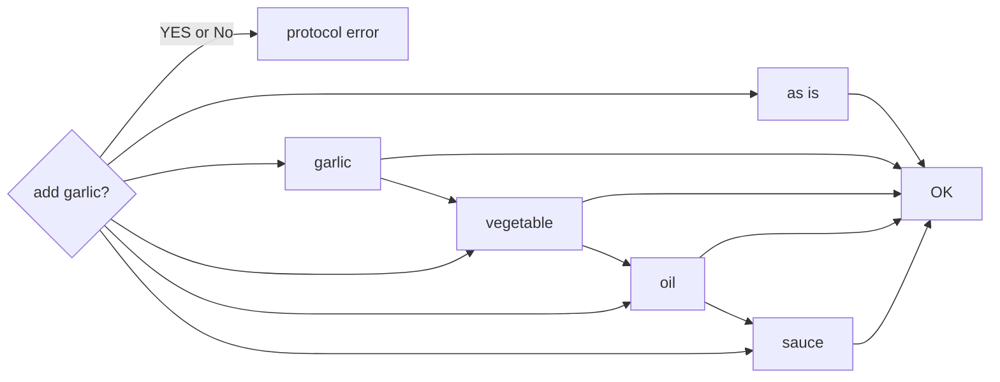

# SlidevのMarkdown記法<br>サンプル

ここに記載できてないのもあります！

---
layout: intro
---

# 1章

layoutの種類がいくつかデフォルトで用意されていてlayoutに指定するとこういう風に表示されます．

---
layout: intro
class: 'text-center'
---

# 1章

classを指定したら場所を中央表示もできます．

---
layout: cover
background: https://fastly.picsum.photos/id/130/1920/1080.jpg?hmac=CnS3QcMe52jnvtdE0r_YD6qVMEHsWuY1j998yYdVhC8
---

# 1章

coverレイアウトです。 <br>このように背景画像も指定できます。

---

## 1.1. 見出しのレベルや書体の見栄えを見てみよう

<br>

# H1です

## H2です

### H3です

#### H4です

##### H5です

これは本文です。H4から先は書体が変わりませんね。どうやら有効なのはH3まででしょうか。<br>
でも、H3はかなり小さい文字になるのと灰色なのでほとんど使う機会はない印象。<br>

使用するテーマを変えたり、テーマをカスタマイズすることで変更できそうです。<br>
よいテーマを見つけた/作った方はぜひ教えて下さい。

**これは本文です(太字)**  
~~これも本文です(取り消し)~~  
*じゃあ私も本文です(イタリック)*  
なお、&#045;&#045;&#045; を書くとページが区切られます。お試しくださいませ。

---
layout: two-cols-header
---

## 1.2. リスト

リストの表示を見てみましょう。<br>
二段組のレイアウトを使って左右にコンテンツを配置していますのでその記法もご確認ください。

::left::

### こちらは箇条書きリスト

- AAAA
    - aaaa
    - aaaa
- BBBB
    - bbbb
    - bbbb

::right::

### こちらは番号付きリスト〜

1. AAAA
    1. aaaa
    1. aaaa
1. bbbb
    1. BBBB
    1. bbbb

普通、Markdownで`- [ ]`と書くとチェックボックスとして描画されますが，Slidevでは...?  
まだ，うまく描画されない状態です(0.51.0-beta.4)

- [ ] タスク1
- [x] タスク2
    - [x] タスク2-1

---
layout: default
---

## 1.3. テーブル

テーブルがどのように表示されるか見てみましょう。  
リンクの表示も使ってみました！(唐突なPython)  
[Python](https://www.python.org/)には、シーケンス型に属する型として以下があります。

| 型                                                                                                                | 概要                                            |
|------------------------------------------------------------------------------------------------------------------|-----------------------------------------------|
| [リスト](https://docs.python.org/ja/3/library/stdtypes.html#lists)                                                  | データの並びを表現できます。                                |
| [タプル](https://docs.python.org/ja/3/library/stdtypes.html#tuples)                                                 | リストと同じように使えますが、<br/>生成後は中身を変更できないことが保証されています。 |
| [range](https://docs.python.org/ja/3/library/stdtypes.html#ranges)                                               | 数の並びを表します。ループと組み合わせて使うことが多いです。                |
| [テキストシーケンス](https://docs.python.org/ja/3/library/stdtypes.html#text-sequence-type-str)                           | いわゆる文字列型です。                                   |
| [バイナリシーケンス](https://docs.python.org/ja/3/library/stdtypes.html#binary-sequence-types-bytes-bytearray-memoryview) | バイナリ(バイト列)を扱えます。                              |

---
layout: two-cols-header
---

## 1.4. 画像

Gridレイアウトをタイルのようにつかうのも良さそうですね。  
picsumを使っているのでreloadすると画像がランダムで切り替わります．
::left::

## [Random](https://picsum.photos/)


## [Random2](https://picsum.photos/)


::right::

## [Seedの指定](https://picsum.photos/)


## Local

画像などのassetsは`/public`ディレクトリ配置するとrootにcopyされます．


---
layout: center
---

## 1.5. アイコン

[Icons | Slidev](https://sli.dev/features/icons#icons) にアイコンの参照方法が記載されています．  
各ロゴは，`npm install`しておく必要があります．

<div class="grid grid-cols-3">

[//]: # (row-1)
  <div><logos-chrome class="text-5xl m-4 animate-bounce"/></div>
  <div><logos-firefox class="text-5xl m-4 animate-bounce"/></div>
  <div><logos-microsoft-edge class="text-5xl m-4 animate-bounce"/></div>

[//]: # (row-2)
  <div><twemoji-grinning-face-with-sweat class="text-5xl m-4 animate-pulse"/></div>
  <div><twemoji-party-popper class="text-5xl m-4 animate-ping"/></div>
  <div><twemoji-cat-with-tears-of-joy class="text-5xl m-4 animate-shake"/></div>

[//]: # (row-3)
  <div><uim-rocket class="text-5xl m-4"/></div>
  <div><uim-rocket class="text-5xl m-4 text-red-400" /></div>
  <div><uim-rocket class="text-5xl m-4 text-orange-400 animate-back-in-up" /></div>
</div>

Tailwindのclassを使ってanimation gridを使ったレイアウトの調整も可能です．

- [Tailwind CSS(animation)](https://tailwindcss.com/docs/animation)
- [Tailwind CSS(grid)](https://tailwindcss.com/docs/grid-template-columns)

---

## 1.6. コード

行番号が表示されているのは `lines: true` のおかげです。  
デフォルトは表示ありです．  
4行目以降がハイライトされているのは `{4-}` のおかげです。

<div class="grid grid-cols-2 gap-1">

<div>

## Before

```python {4-}{lines:true}
import os
test_path = os.path.join("data", "data-01.txt")

f = open(test_path, "a", encoding="utf-8")
f.write("this is new append line\n")
f.close()
```

</div>

<div>

## After

```python {4-}
import os
test_path = os.path.join("data", "data-01.txt")

with open(test_path, "a", encoding="utf-8") as f:
    f.write("this is new append line\n")
```

</div>
</div>

[こちら](https://sli.dev/features/code-block-line-numbers)
を参考にして行番号を非表示することもできました

```bash {lines:false}
$ ps aux
USER         PID %CPU %MEM    VSZ   RSS TTY      STAT START   TIME COMMAND
root           2  0.0  0.0      0     0 ?        S     7月20   0:00 [kthreadd]
root           3  0.0  0.0      0     0 ?        I<    7月20   0:00 [rcu_gp]
root           4  0.0  0.0      0     0 ?        I<    7月20   0:00 [rcu_par_gp]
root          12  0.0  0.0      0     0 ?        S     7月20   0:07 [migration/0]
```

---

## 1.7. LaTeX

組版にも対応。数式をかっこよく書きたい場合に使えそうですね。

$\sqrt{3x-1}+(1+x)^2$

これは中央に配置されるようです。

$$
\begin{array}{c}

\sin x = \sum_{n=0}^{\infty} \frac{(-1)^n}{(2n+1)!} x^{2n+1}

\end{array}
$$

であるからして、これがこうなってこうじゃ。

$$
\begin{array}{c}

\nabla \times \vec{\mathbf{B}} -\, \frac1c\, \frac{\partial\vec{\mathbf{E}}}{\partial t} &
= \frac{4\pi}{c}\vec{\mathbf{j}} \nabla \cdot \vec{\mathbf{E}} & = 4 \pi \rho \\

\nabla \times \vec{\mathbf{E}}\, +\, \frac1c\, \frac{\partial\vec{\mathbf{B}}}{\partial t} & =
\vec{\mathbf{0}} \\

\nabla \cdot \vec{\mathbf{B}} & = 0

\end{array}
$$

このページは講義資料のような雰囲気がありますね。

---

## 1.8. Twitter

Vueのコンポーネントが使えるので簡単に埋め込めます。<br>
画像ではないので文字コピーやリンククリックもできます。

<div class="grid grid-cols-10">

<div class="col-span-4 mt-30">
Markdownに書くのはこれだけでOK。

```markdown
<Tweet id="1390680015721795591"/>
```

</div>


<div  class="col-span-6 place-self-center">
<Tweet id="1390680015721795591" scale="0.75"/>
</div>

</div>

---
layout: center
---

## 1.9. YouTube動画の埋め込み

こういう風にYoutubeの表示できます．

[//]: # (YouTube動画の埋め込みコード&#40;HTML&#41;を貼りつけてみました。動画が埋め込めています。  )

[//]: # (スライド上で動画を再生できるのは画面切り替えが不要なので嬉しいですね。  )

[//]: # (YouTubeに限らず、各種サイトで埋め込みコードが用意されているものはスライドに埋め込める可能性があります。  )

[//]: # (ただし&lt;scrpit&gt;タグで埋め込むタイプのコンテンツは埋め込めないかもです。)

<Youtube id="ekr2nIex040" width="560" height="315" />

[//]: # (<iframe width="560" height="315" src="https://www.youtube.com/embed/ekr2nIex040?si=GADdFis6n-y9kRdP" title="YouTube video player" frameborder="0" allow="accelerometer; autoplay; clipboard-write; encrypted-media; gyroscope; picture-in-picture; web-share" referrerpolicy="strict-origin-when-cross-origin" allowfullscreen></iframe>)

---

## 1.10. Flowchart diagrams

[Mermaid記法](https://sli.dev/guide/syntax.html#diagrams) による Jiro Flow



---
layout: cover
---

# ご清聴ありがとうございました。

よいSlidevライフを！


---

## 1.8. Twitter

# My Slide

<Counter :count="4"/>

